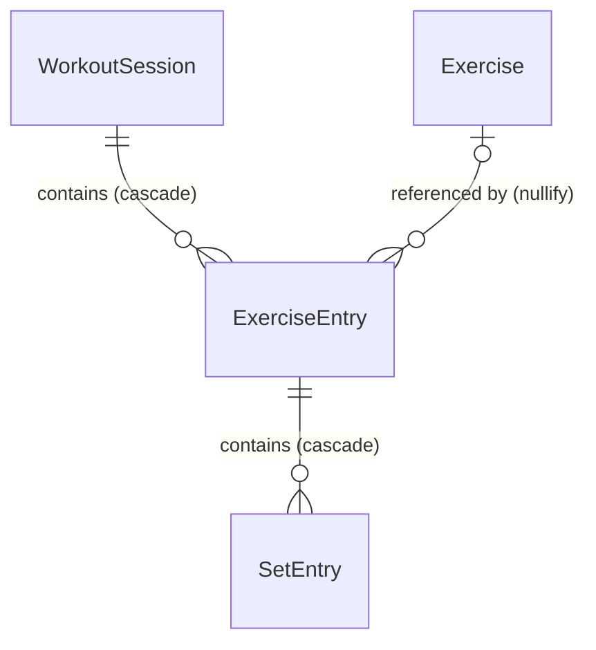

# KASANE Data Model

この文書は、現在のKASANEデータモデルの構造と設計意図を理解しやすくするための補助ドキュメントです。

実際のSwiftDataスキーマについては `Sources/Models/` の実装およびテストを正とします。将来予定されているモデルを示すものではありません。

## ERD

## モデルの責務

- `WorkoutSession`: 1回のトレーニング。開始・終了日時と任意のメモを保持する。
- `Exercise`: 現在の種目マスター。名称、主要部位、アーカイブ状態を保持する。
- `ExerciseEntry`: 特定のWorkoutSessionで行った種目。表示順と実施時点の名称・主要部位を保持する。
- `SetEntry`: 1セットの実績。順序、kg基準の重量、回数、ウォームアップ状態を保持する。

各モデルは永続的な識別子として `UUID` の `id` を持ちます。主要部位は、保存・検索が単純な文字列として永続化し、アプリ内では `BodyPart` に変換します。

## RelationshipとDelete Rule

`WorkoutSession.exerciseEntries` と `ExerciseEntry.setEntries` は `.cascade` です。親を削除すると、そのWorkoutSessionだけに属する中間レコードとセットも削除され、孤児を残しません。

`Exercise.exerciseEntries` は `.nullify` です。通常は種目を物理削除せず `isArchived` で新規選択から除外します。仮にExerciseを削除しても過去のExerciseEntryは残ります。この削除を安全に表現するため、SwiftData上の `ExerciseEntry.workoutSession`、`exercise`、`SetEntry.exerciseEntry` は任意Relationshipです。通常の生成時にはinitializerが親を必須とし、不完全なグラフを作らないようにしています。

## ExerciseとExerciseEntryを分ける理由

`Exercise` は現在のマスター、`ExerciseEntry` は過去に実施した事実です。分離することで同じ種目を複数WorkoutSessionから参照でき、種目マスターの変更と過去の記録を独立させられます。

`ExerciseEntry` は生成時の種目名と主要部位をスナップショットとして保持します。後からExerciseを改名・再分類・アーカイブしても、当時の履歴、Stats、Replayを当時の値で再現できます。

## Source of Truth

Stats / Replayの集計結果は保存しません。WorkoutSession、ExerciseEntry、SetEntryを記録のSource of Truthとして必要時に算出し、導出値の不整合を避けます。

## 進行中Workoutのライフサイクル

`WorkoutSession.endedAt == nil` を進行中の唯一の永続状態として扱います。アプリ起動時に特別な画面状態を復元するのではなく、Home画面がSwiftDataから進行中セッションを取得し、ユーザーの操作によって再開します。

開始・再開・破棄と明示的な保存は `WorkoutSessionService` が担当します。開始時に既存の進行中セッションを先に検索することで重複作成を避け、破棄時には既存のcascade delete ruleを利用して配下の記録も削除します。通常の戻る操作は永続データを変更しません。

## 組み込み種目とセッションへの記録

`ExerciseCatalogService` はアプリ利用時に組み込み種目をseedします。各種目に安定したUUIDを割り当て、存在しないIDだけを追加するため、繰り返し実行しても重複せず、既存Exerciseの名称・部位・アーカイブ状態を上書きしません。アーカイブ済みExerciseは新しいセッションの選択対象外です。

進行中Workoutでは、選択可能な全Exerciseから種目入力画面へ直接遷移します。画面を開いた時点ではExerciseEntryを作らず、最初の有効なセットを保存するときに、`WorkoutExerciseService`がExerciseEntryとSetEntryを同一トランザクションで作成します。このため、何も入力せず戻った種目や不正なDraftから空の実施記録は残りません。同一セッションに同じExerciseのEntryが存在する場合は重複作成を拒否します。

`ExerciseEntry.order`は進行中Workoutの「直近に記録・更新した順」を表します。最初のセット保存、セット追加、セット更新、セット削除の対象種目をorder 0へ移し、残る種目を相対順を保った0始まりの連番へ正規化します。このorderは即時保存されるため、アプリを再起動してWorkoutを再開した場合も同じ並び順を復元できます。種目削除時も残ったExerciseEntryのorderを連番へ振り直します。入力前の空のSet 1は画面だけのDraftであり、SetEntryとして永続化しません。

`WorkoutDraftStore` はアプリ起動中だけ、未確定Draftの重量と回数をSessionとExerciseEntryごとに入力文字列のまま保持します。ExerciseEntry生成前の種目についてもSessionとExerciseごとに分離して保持するため、入力途中で一覧へ戻っても同じ種目を開き直せば復元できます。ホームへ戻って同じ進行中Workoutを再開しても保持しますが、アプリ終了・再起動後には復元しません。DraftをSetEntryとして追加する場合、Workoutを正常終了または中止する場合、対象種目を削除する場合は不要な保持状態を消去します。
